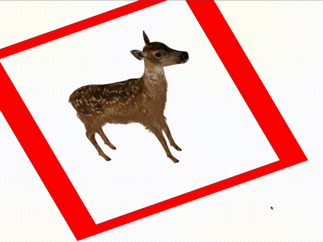
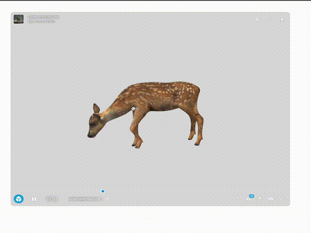
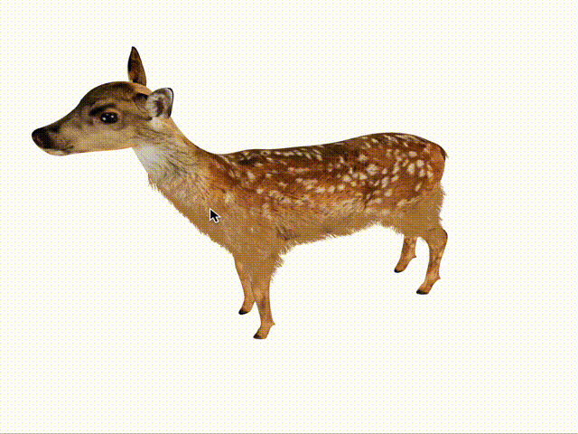

## Introduction

What do the *Avatar* movie, a Rubik’s cube and car gear parts have in common? You were right: 3 dimensions (3D)!

I majored in 3D modeling which is a topic I adore. This technology is broadly used: animation, video game, computer-aided-design, etc. Then, I was recruited by [Theodo](https://www.theodo.fr/) as a software engineer to build web applications which caught my attention.
As I kept working, I started to wonder how to combine 3D and the web in a project. This combination may help you complete your objectives in various ways such as:

- Keeping your customers on the website by having a refreshing experience ([a scrolling experience with 3D animations instead of a scrollbar](https://about.mav.farm/mavfarm))
- Increasing your conversion rate (e-business / e-commerce) with an almost real visualization of your products ([a use case for selling kitchen furniture](https://kitchen.planner.ikea.com/fr/fr/planner/))
- Providing powerful prototyping tools for large teams (design and prototypes for car pieces)

It is also the opportunity to discover a new domain (3D) which is always exciting!

My objective is to show you that 3D effects in a web context can be implemented with ease. Thus, I will describe 3 web-ready technologies and integrate them in an application.

TLDR [The repo I used to experiment with](https://github.com/soldierhonor/web-3d-journey) (it is a simple React TS application).

## CSS

CSS is a great start since some features already correspond to 3D ones.

My first encounter with 3D in a web application development context was a [‘box-shadow’](https://developer.mozilla.org/en-US/docs/Web/CSS/box-shadow). After all, projecting a shadow for your components displays a perspective view which highlights them.

Lot more things can be done using [CSS](https://developer.mozilla.org/en-US/docs/Web/CSS/transform) and some html. Rotating, translating, scaling your components with animations is very efficient and not time-consuming. A snippet for rotating an image:

```css
@keyframes rotate {
  to {
  // the 3D transformation
  transform: rotate3d(1, 1, 1, 360deg);
  }
}
animation: rotate 3s linear infinite;
```

⚠️ For a better accessibility, you should take into account whether the user wants the least amount of motion with [the prefers-reduced-motion media query](https://developer.mozilla.org/en-US/docs/Web/CSS/@media/prefers-reduced-motion).

For the majority of the article, I experimented with a [free 3D model](https://sketchfab.com/3d-models/deer-animations-e40b5345daaf4dee85e650942db057a8) created by [dinomaster](https://sketchfab.com/dinomaster).



By coupling your CSS style with some JS you can achieve incredible features which are business changing: [an example with an interactive Pokemon-card website using SvelteJS](https://deck-24abcd.netlify.app/)


However, CSS still has its limitations since 2D images are not 3D models!
For example in the deer gif even after rotating it, its other profile cannot be seen. They are comparable to the differences between taking a photo of a deer and seeing it with your own eyes.
## Sketchfab

I tried [Sketchfab](https://sketchfab.com/feed) which provides both a [3D viewer](https://sketchfab.com/developers/viewer) and  a marketplace for 3D fixtures (a part of them are downloadable freely).

It is easy to setup and is free to use for your personal projects.
I read [this article](https://blog.theodo.com/2020/04/sketchfab-react-part-1/) and the described ‘hook refactor’ works really well to render the sketchfab viewer in an iframe.

```tsx
const useSketchfabViewer = () => {
  // This ref will contain the actual iframe object
  const viewerIframeRef = useRef(null);
  const [api, setApi] = useState();

  // We feed the ref to the iframe component
  // to get the underlying DOM object
  const ViewerIframe = (
    <iframe
      ref={viewerIframeRef}
      title="sketchfab-viewer"
    />
  );

  useEffect(
    () => {
      // Initialize the viewer
      let client = new Sketchfab(viewerIframeRef.current);
      client.init(deer, {
        success: setApi,
        error: () => {
          console.log("Viewer error");
        },
      });
    },
    [] // Initialize the viewer only on first load
  );

  return [ViewerIframe, api];
};

// Reusable component
const Viewer = ({ apiRef }) => {
  const [ViewerIframe, api] = useSketchfabViewer();

  apiRef.current = api;

  return ViewerIframe ?? null;
};

// Use of the Sketchfab viewer
const ViewerComponent = () => {
  const apiRef = useRef(null);

  return (
    <div>
      <Viewer apiRef={apiRef} />
    </div>
  );
}
```



Mouse interactions are built-in, and it supports tons of formats which is very useful if you have little idea of your inputs. Also, a [REST API](https://docs.sketchfab.com/data-api/v3/index.html) is available and looks promising. It is a great library to use if you need to rush.

However, all features are not free, the code is not open source, and you will not learn much about 3D using it.

## ThreeJS

Following my journey, I wanted to customize my 3D viewer freely. I looked at [the open source library: three.js](https://threejs.org/docs/index.html#manual/en/introduction/Creating-a-scene) which, in its core, uses [the javascript api to display 3D objects: webGL](https://www.khronos.org/webgl/).

For React, I recommend [react-three-fiber](https://docs.pmnd.rs/react-three-fiber/getting-started/introduction) with [react-three/drei](https://github.com/pmndrs/drei) for which I provide a snippet for a simple implementation:
```tsx
const Model: React.FC = (): JSX.Element => {
  // 🦌 1 Load the model 🦌
  // the path to the model
  const deer = 'assets/deer_animations/scene.gltf';

  // we use a GLTFLoader because of
  // the format of the model (.gltf)
  const gltf = useLoader(GLTFLoader, deer);

  // 🥳 2 Put the model in a component 🥳
  return (
    <Suspense fallback={null}>
      <primitive object={gltf.scene} />
    </Suspense>
  );
}

const ThreeCanvas = () => {
  return(
    <div>
      <!-- 🎁 3 Wrap the model component with a Canvas 🎁 -->
      <Canvas>
        <Model />
        <!-- 🔆 4 Light to see the result 🔆 -->
        <ambientLight intensity={1.0} />
        <!-- 🎆 BONUS Easy user mouse interaction 🎆 -->
        <OrbitControls />
      </Canvas>
    </div>
  );
}
```




It is highly customizable because only a canvas element is needed. Since ThreeJS is an open-source project, tons of features and libraries are available.

If you are interested to understanding 3D, I recommend reading the [threejs e-book](https://discoverthreejs.com/) which not only describe how the library works but also explain 3D graphic basics

Thanks to the size of the community ([90k stars](https://github.com/mrdoob/three.js/stargazers) on github and [975 951 weekly downloads](https://www.npmjs.com/package/three) on npm when I wrote the article), several ThreeJS related projects exist. They adapt the library to popular frameworks (React as shown above, Svelte: [svelthree](https://svelthree.dev/) and [svelte-cubed](https://svelte-cubed.vercel.app/)). Thus, you do not have to start from scratch!

However, it may take time to assimilate everything. So, if you have to go fast, or you do not want to learn about 3D this much, it is not the first choice.

One of the most captivating use case is a [3D interactive background](https://www.youtube.com/watch?v=Q7AOvWpIVHU) (credits to [Fireship](https://www.youtube.com/@Fireship)).
Using this library, I also managed to recreate a simplified [Mario-Kart game](https://github.com/RemiPeruto/3d-game) which you can reuse as a base.

## Conclusion

To recap, I introduced ways to add 3D in a web application. With an evolution from well-known to discovered web-ready technologies, I shared reusable snippet examples.

I have just been scratching the surface of web 3D technologies. There are more I want to try:

- [BabylonJS](https://www.babylonjs.com/) which implements the [webgpu API](https://www.w3.org/TR/webgpu/)
- Big companies’ application ([3DExperince](https://www.3ds.com/3dexperience), [Maya](https://www.autodesk.com/))
- Implementing my own

To finish, my favorite technology is three.js because of its high degree of customization and of its ease of use. The community is big and tons of libraries await you! To start your own React TS application, do not forget using:

- [react-three/fiber](https://docs.pmnd.rs/react-three-fiber/getting-started/introduction) (React wrapper for three.js)
- [react-three/drei](https://github.com/pmndrs/drei) (library containing OrbitControls)

Will you use 3D in your projects? I hope I could narrow the gap to enter web 3D.
